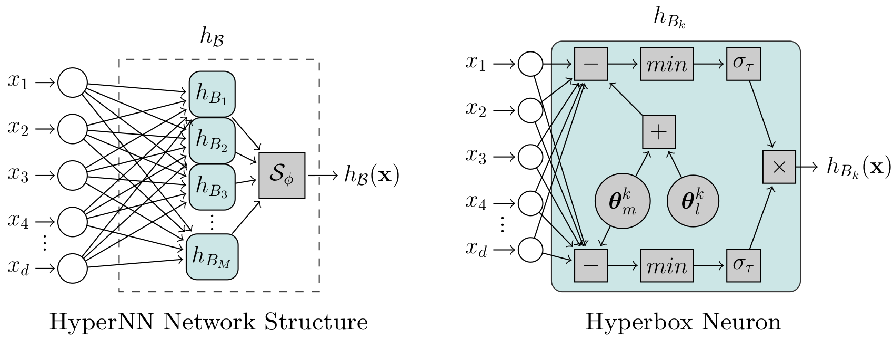

# HyperNN: End-to-End Neural Network Training for Hyperbox-Based Classification

Hyperbox-based classification has been seen as a promising technique in which decisions on the data are represented as a series of orthogonal, multidimensional boxes (i.e., hyperboxes) that are often interpretable and human-readable. However, existing methods are no longer capable of efficiently handling the increasing volume of data many application domains face nowadays. We address this gap by proposing a novel, fully differentiable framework for hyperbox-based classification via neural networks. In contrast to previous work, our hyperbox models can be efficiently trained in an end-to-end fashion, which leads to significantly reduced training times and superior classification results.

# General Structure
- `src/models`: main HyperNN implementation and wrapper for PRIM.
- `src/evaluation`: simple implementation of hyperparameter tuning and model evaluation.
- `src/datasets`: code for collecting and using datasets.
- `run_experiments.py`: Code for reproducing experiments.

